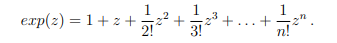
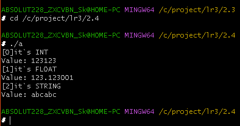

# Структуры. Объединения. Перечисления.
### 1.1 Постановка задачи:
Создать некоторую структуру с указателем на некоторую функцию в качестве поля. Вызвать эту функцию через имя переменной этой структуры и поле указателя на функцию.
### Математическая модель:

### Список идентификаторов:
<table>
  <tr>
    <th>имя</th>
    <th>тип</th>
	<th>смысл</th>
  </tr>
  <tr>
    <td>calc</td>
    <td>struct</td>
    <td>инициализация структуры</td>
  </tr>
</table>

### Код программы:


```C
#include <stdio.h>

  

typedef int (*func)(int, int);

  

struct calculate

{

    int a;

    int b;

    func op;

};

  

int add(int a, int b){return a + b;}

  

int min(int a, int b){return a - b;}

  

int main(void)

{

    struct calculate calc;

    printf("imput num,s\n");

    scanf("%d", &calc.a);

    scanf("%d", &calc.b);

  

    calc.op = add;

  

    printf("a + b = %d\n", calc.op(calc.a, calc.b));

  

    calc.op = min;

  

    printf("a - b = %d\n", calc.op(calc.a, calc.b));

  

    return 0;

}
```

### Результаты работы программы:


### 1.2 Постановка задачи:
Создать структуру для вектора в 3-х мерном пространстве. Реализовать и использховать в своей программе следующие операции над векторами: • скалярное умножение векторов; • векторное произведение; • модуль вектора; • распечатка вектора в консоли. В структуре вектора указать имя вектора в качестве отдельного поля этой структуры.
### Математическая модель:

### Список идентификаторов:
<table>
  <tr>
    <th>имя</th>
    <th>тип</th>
	<th>смысл</th>
  </tr>
  <tr>
    <td>а</td>
    <td>struct</td>
    <td>первый вектор</td>
  </tr>
  <tr>
    <td>b</td>
    <td>struct</td>
    <td>второй вектор</td>
  </tr>
</table>

### Код программы:


```C
#include <stdio.h>

#include <math.h>

  

struct vector

{

    double x;

    double y;

    double z;

    char *name;

};

  

int main(void)

{

    struct vector a;

    a.name = "a";

    printf("input vector %c cords(x, y, z)\n", *a.name);

    scanf("%lf", &a.x);

    scanf("%lf", &a.y);

    scanf("%lf", &a.z);

  

    struct vector b;

    b.name = "b";

    printf("input vector %c cords(x, y, z)\n", *b.name);

    scanf("%lf", &b.x);

    scanf("%lf", &b.y);

    scanf("%lf", &b.z);

  

    double res;

  

    res = a.x * b.x + a.y * b.y + a.z * b.z;

    printf("scalar vector multiplication - %lf\n", res);

  

    //res = a.y * b.z - a.z * b.y - a.x * b.z + a.z * b.x + a.x * b.y -a.y * b.x;

    printf("vector product %c * %c : ",*a.name, *b.name);

    res = a.y * b.z - a.z * b.y;

    printf("(%lf, ", res);

    res = a.z * b.x - a.x * b.z;

    printf("%lf, ", res);

    res = a.x * b.y -a.y * b.x;

    printf("%lf)\n", res);

  

    res = pow(a.x * a.x + a.y * a.y + a.z * a.z, 1.0/2.0);

    printf("vector module for %c - %lf\n", *a.name, res);

    res = pow(b.x * b.x + b.y * b.y + b.z * b.z, 1.0/2.0);

    printf("vector module for %c - %lf\n", *b.name, res);

  

    printf("%c: (%lf, %lf, %lf)\n", *a.name, a.x, a.y, a.z);

    printf("%c: (%lf, %lf, %lf)\n", *b.name, b.x, b.y, b.z);

  

    return 0;

}
```

### Результаты работы программы:


### 1.3 Постановка задачи:
Вычислить, используя структуру комплексного числа, комплексную экспоненту exp(z) некоторого z ∈ C:
### Математическая модель:



### Список идентификаторов:
<table>
  <tr>
    <th>имя</th>
    <th>тип</th>
	<th>смысл</th>
  </tr>
  <tr>
    <td>n</td>
    <td>int</td>
    <td>ограничение для for</td>
  </tr>
  <tr>
    <td>fact</td>
    <td>int</td>
    <td>накопление факториала</td>
  </tr>
  <tr>
    <td>i</td>
    <td>int</td>
    <td>параметр цикла</td>
  </tr>
  <tr>
    <td>z</td>
    <td>struct</td>
    <td>изначальное комплексное число</td>
  </tr>
  <tr>
    <td>z_power</td>
    <td>struct</td>
    <td>накопление степеней комплекного числа</td>
  </tr>
  <tr>
    <td>term</td>
    <td>struct</td>
    <td>деление на факториал</td>
  </tr>
  <tr>
    <td>res</td>
    <td>struct</td>
    <td>накопление результата</td>
  </tr>
</table>

### Код программы:


```C
#include <stdio.h>

#include <math.h>

  

//структура комплексных

struct complex

{

    double real;

    double img;

};

  

// умножение комплексных

struct complex multiply(struct complex a, struct complex b)

{

    struct complex result;

    result.real = a.real * b.real - a.img * b.img;

    result.img = a.real * b.img + a.img * b.real;

    return result;

}

  

// сумма комплексных

struct complex add(struct complex a, struct complex b)

{

    struct complex result;

    result.real = a.real + b.real;

    result.img = a.img + b.img;

    return result;

}

  

// деление комплексного на число

struct complex divide(struct complex a, double b)

{

    struct complex result;

    result.real = a.real / b;

    result.img = a.img / b;

    return result;

}

  
  

int main(void)

{

    int n;

    int fact = 1;

  

    printf("input real and img\n");

    struct complex z;

    scanf("%lf", &z.real);

    scanf("%lf", &z.img);

  

    struct complex z_power = {1.0, 0.0};

    struct complex term = {1.0, 0.0};

    struct complex result = {0.0, 1.0};

  

    printf("input n\n");

    scanf("%d", &n);

  

    for(int i = 1; i<=n; i++)

    {

        fact = fact * i;

        z_power = multiply(z_power, z);

        term = divide(z_power, fact);

        result = add(result, term);

    }

  

    printf("Result: %f + %fi\n", result.real, result.img);

    return 0;

}
```

### Результаты работы программы:


### 1.4 Постановка задачи:
Используя так называемые "битовые" поля в структуре C, создать экономную структуру в оперативной памяти для заполнения даты некоторого события, например даты рождения человека
### Математическая модель:

### Список идентификаторов:
<table>
  <tr>
    <th>имя</th>
    <th>тип</th>
	<th>смысл</th>
  </tr>
  <tr>
    <td>birthday</td>
    <td>struct</td>
    <td>некоторая дата</td>
  </tr>
  <tr>
    <td>tmp_day</td>
    <td>int</td>
    <td>ввод дня</td>
  </tr>
  <tr>
    <td>tmp_month</td>
    <td>int</td>
    <td>ввод месяца</td>
  </tr>
  <tr>
    <td>tmp_year</td>
    <td>int</td>
    <td>ввод года</td>
  </tr>
</table>

### Код программы:


```C
#include <stdio.h>

#include <math.h>

  

struct date

{

    unsigned int year : 7;

    unsigned int month : 4;

    unsigned int day : 5;

};

  

int main(void)

{

    struct date birthday;

    unsigned int tmp_day, tmp_month, tmp_year;

  

    printf("input your birthday date\n");

    scanf("%u", &tmp_day);

    scanf("%u", &tmp_month);

    scanf("%u", &tmp_year);

  

    birthday.day = tmp_day;

    birthday.month = tmp_month;

    birthday.year = tmp_year - 1970;

  

    printf("Your birthday day is: %d.%d.%d", birthday.day, birthday.month, birthday.year + 1970);

    return 0;

}
```

### Результаты работы программы:


### 1.5 Постановка задачи:
Реализовать в виде структур двунаправленный связный список и совершить отдельно его обход в прямом и обратном направлениях с распечаткой значений каждого элемента списка.
### Математическая модель:

### Список идентификаторов:
<table>
  <tr>
    <th>имя</th>
    <th>тип</th>
	<th>смысл</th>
  </tr>
  <tr>
    <td>node1</td>
    <td>Node *</td>
    <td>1-й элемент</td>
  </tr>
  <tr>
    <td>node2</td>
    <td>Node *</td>
    <td>2-й элемент</td>
  </tr>
  <tr>
    <td>node3</td>
    <td>Node *</td>
    <td>3-й элемент</td>
  </tr>
  <tr>
    <td>curent</td>
    <td>Node *</td>
    <td>для перебора в цикле</td>
  </tr>
</table>

### Код программы:


```C
#include <stdio.h>

#include <stdlib.h>

  

typedef struct Node {

    int data;

    struct Node* next;

    struct Node* prev;

} Node;

  

int main() {

    Node* node1 = (Node*)malloc(sizeof(Node));

    Node* node2 = (Node*)malloc(sizeof(Node));

    Node* node3 = (Node*)malloc(sizeof(Node));

  

    node1->data = 10;

    node1->prev = NULL;

    node1->next = node2;

  

    node2->data = 20;

    node2->prev = node1;

    node2->next = node3;

  

    node3->data = 30;

    node3->prev = node2;

    node3->next = NULL;

  

    printf("direct order: ");

    Node* current = node1;

    while (current != NULL) {

        printf("%d ", current->data);

        current = current->next;

    }

  

    printf("\nreverse order: ");

    current = node3;

    while (current != NULL) {

        printf("%d ", current->data);

        current = current->prev;

    }

  

    // Освобождаем память

    free(node1);

    free(node2);

    free(node3);

  

    return 0;

}
```

### Результаты работы программы:


### 2.1 Постановка задачи:
Напишите программу, которая использует указатель на некоторое объединение union.
### Математическая модель:

### Список идентификаторов:
<table>
  <tr>
    <th>имя</th>
    <th>тип</th>
	<th>смысл</th>
  </tr>
  <tr>
    <td>test</td>
    <td>uni</td>
    <td>объединение</td>
  </tr>
</table>

### Код программы:


```C
#include <stdio.h>

#include <stdlib.h>

#include <malloc.h>

  

typedef union uni

{

    unsigned int a;

    unsigned char b;

}uni;

  

int main(void)

{

    uni *test = (uni *)malloc(sizeof(uni));

    test->a = 123123;

    printf("%d, %c", test->a, test->b);

    free(test);

    return 0;

}
```

### Результаты работы программы:


### 2.2 Постановка задачи:
Напишите программу, которая использует union для побайтовой распечатки типа unsigned long.
### Математическая модель:

### Список идентификаторов:
<table>
  <tr>
    <th>имя</th>
    <th>тип</th>
	<th>смысл</th>
  </tr>
  <tr>
    <td>first</td>
    <td>union bit</td>
    <td>объединение</td>
  </tr>
</table>

### Код программы:


```C
#include <stdio.h>

#include <stdlib.h>

#include <malloc.h>

  

union bit

{

    unsigned long obj;

    unsigned char b[8];

};

  

int main(void)

{

    union bit first;

    first.obj = 123123;

  

    size_t size = sizeof(first.obj);

  

    for(size_t i = 0; i<size; i++)

    {

        printf("%u\n", first.b[i]);

    }

  

    return 0;

}
```

### Результаты работы программы:


### 2.3 Постановка задачи:
Создайте перечислимый тип данных (enum) для семи дней недели и распечатайте на экране его значения, как целые числа.
### Математическая модель:

### Список идентификаторов:
<table>
  <tr>
    <th>имя</th>
    <th>тип</th>
	<th>смысл</th>
  </tr>
  <tr>
    <td>day</td>
    <td>week</td>
    <td>перебор enum-а</td>
  </tr>
</table>

### Код программы:


```C
#include <stdio.h>

  

enum week

{

    SUNDAY,

    MONDAY,

    TUESDAY,

    WEDNESDAY,

    THURSDAY,

    FRIDAY,

    SATURDAY

};

  

int main(void)

{

    enum week day;

    day = SUNDAY;

    printf("%d ", day);

  

    day = MONDAY;

    printf("%d ", day);

  

    day = TUESDAY;

    printf("%d ", day);

  

    day = WEDNESDAY;

    printf("%d ", day);

  

    day = THURSDAY;

    printf("%d ", day);

  

    day = FRIDAY;

    printf("%d ", day);

  

    day = SATURDAY;

    printf("%d ", day);

  

    return 0;

}
```

### Результаты работы программы:


### 2.4 Постановка задачи:
Создайте так называемое размеченное объединение union, которое заключено в виде поля структуры struct вместе с ещё одним полем, которое является перечислением enum и служит индикатором того, что именно на текущий момент хранится в таком вложенном объединении. Создать и заполнить динамический массив таких структур с объединениями внутри, заполняя вспомогательное поле перечисления enum для сохранения информации о хранимом в каждом размеченном объединении типе данных. Реализовать распечатку данных массива таких структур в консоль.
### Математическая модель:

### Список идентификаторов:
<table>
  <tr>
    <th>имя</th>
    <th>тип</th>
	<th>смысл</th>
  </tr>
  <tr>
    <td>size</td>
    <td>int</td>
    <td>Размеры массива</td>
  </tr>
  <tr>
    <td>array</td>
    <td>struct_data</td>
    <td>Массив</td>
  </tr>
  <tr>
    <td>i</td>
    <td>int</td>
    <td>параметр цикла</td>
  </tr>
</table>

### Код программы:


```C
#include <stdio.h>

#include <stdlib.h>

#define max_len 32

  

typedef enum

{

    int_type,

    float_type,

    str_type

} indicate;

  

typedef union

{

    int i_data;

    float f_data;

    char s_data[max_len];

}data;

  

typedef struct

{

    indicate ind;

    data type;

} struct_data;

  

void print_struct_data(struct_data* sd)

{

    switch(sd->ind)

    {

        case int_type:

            printf("it`s INT\nValue: %d\n", sd->type.i_data);

            break;

        case float_type:

            printf("it`s FLOAT\nValue: %f\n", sd->type.f_data);

            break;

        case str_type:

            printf("it`s STRING\nValue: %s\n", sd->type.s_data);

            break;

        default:

            printf("Type Error!");

    }

}

  

int main (void)

{

    int size = 3;

    struct_data array [3] = {

  

    {.ind = int_type,

    .type.i_data = 123123},

    {.ind = float_type,

    .type.f_data = 123.123},

    {.ind = str_type,

    .type.s_data ="abcabc"}

    };

  

    for(int i = 0; i < size; i++)

    {

        printf("[%d]", i);

        print_struct_data(&array[i]);

    }

  

    return 0;

}
```

### Результаты работы программы:



### Информация о студенте:

Лузан Богдан, 1 курс, группа ИВТ 2.1


