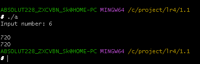
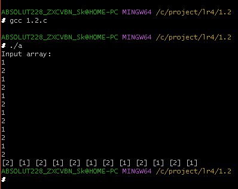
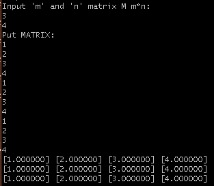
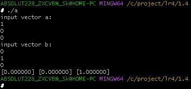
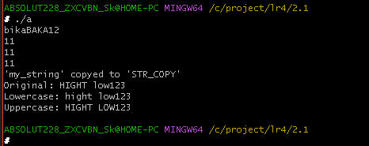
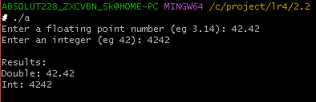
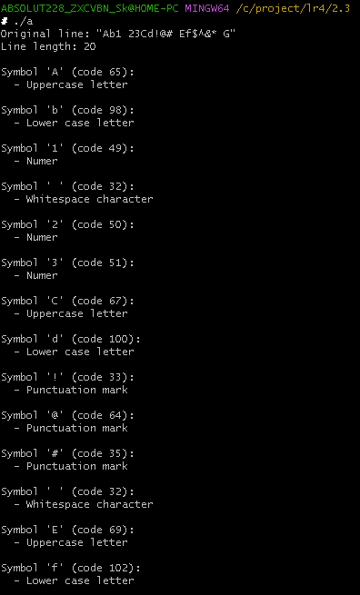

# Введение в функции. Базовая работа со строками (однобайтовыми).
## 1.1 Постановка задачи:
Создайте две функции, которые вычисляют факториал числа: • функцию, которая вычисляет факториал, используя цикл; • функцию, которая вычисляет факториал, используя рекурсивный вызов самой себя. Продемонстрируйте работу обеих функций.
### Математическая модель:
___
### Список идентификаторов:
<table>
  <tr>
    <th>имя</th>
    <th>тип</th>
	<th>смысл</th>
  </tr>
  <tr>
    <td>a</td>
    <td>int</td>
    <td>ввод числа, тип</td>
  </tr>
</table>

### Код программы:


```C
#include <stdio.h>

  

int fact_cikl (int a)

{

    int k = 1;

    for(int i = 1; i <= a; i++)

    {

        k = k * i;

    }

    return k;

}

  

int fact_rekurs (int a)

{

    if (a <= 1)

    {

        return 1;

    }

    else

    {

        a = fact_rekurs(a-1) * a;

        return a;

    }

}

  

int main (void)

{

    int a;

    printf("Input number: ");

    scanf("%d", &a);

  

    printf("\n%d\n%d", fact_cikl(a), fact_rekurs(a));

}
```

### Результаты работы программы:



## 1.2 Постановка задачи:
Объявите указатель на массив типа int и динамически выделите память для 12-ти элементов. Напишите функцию, которая поменяет значения чётных и нечётных ячеек массива.
### Математическая модель:
___
### Список идентификаторов:
<table>
  <tr>
    <th>имя</th>
    <th>тип</th>
	<th>смысл</th>
  </tr>
  <tr>
    <td>array</td>
    <td>int *</td>
    <td>массив</td>
  </tr>
  <tr>
    <td>i</td>
    <td>int</td>
    <td>параметр цикла</td>
  </tr>
</table>

### Код программы:


```C
#include <stdio.h>

#include <stdlib.h>

#include <malloc.h>

#define num 12

  

void swap(int *array)

{

    int temp = 0;

    for(int i = 0; i < num; i += 2)

    {

        temp = array[i];

        array[i] = array[i+1];

        array[i+1] = temp;

    }

}

  

int main (void)

{

    int *array = (int *)malloc(num * sizeof(int));

  

    printf("Input array:\n");

  

    for(int i = 0; i < num; i++)

    {

        scanf("%d", &array[i]);

    }

  

    swap(array);

  

    for(int i = 0; i < num; i++)

    {

        printf("%d", array[i]);

    }

  

    free(array);

    return 0;

}
```

### Результаты работы программы:



## 1.3 Постановка задачи:
Создать две основные функции: • функцию для динамического выделения памяти под двумерный динамический массив типа double — матрицу; • функцию для динамического освобождения памяти под двумерный динамический массив типа double — матрицу. Создать две вспомогательные функции: • функцию для заполнения матрицы типа double; • функцию для распечатки этой матрицы на экране. Продемонстрировать работу всех этих функций в своей программе
### Математическая модель:
___
### Список идентификаторов:
<table>
  <tr>
    <th>имя</th>
    <th>тип</th>
	<th>смысл</th>
  </tr>
  <tr>
    <td>m</td>
    <td>int</td>
    <td>Кол-во строк матрицы</td>
  </tr>
  <tr>
    <td>n</td>
    <td>int</td>
    <td>Кол-во столбцов матрицы</td>
  </tr>
  <tr>
    <td>a</td>
    <td>double **</td>
    <td>Указатель на матрицу</td>
  </tr>
</table>

### Код программы:


```C
#include <stdio.h>

#include <stdlib.h>

#include <malloc.h>

  

int m;

int n;

  

double** MATRIX_MADE(double **a)

{

    a = (double **)malloc(m * sizeof(double *));

  

    for(int i = 0;i < m; i++)

    {

        a [i] = (double *)malloc(n * sizeof(double));

    }

    return a;

}

  

void MATRIX_FREE(double **a, int m)

{

    for(int i = 0;i < m; i++)

    {

        free(a [i]);

    }

  

    free(a);

}

  

void MATRIX_PUT(double **a, int m, int n)

{

    printf("Put MATRIX:\n");

    for(int i = 0;i < m; i++)

    {

        for(int j = 0;j < n; j++)

        {

            scanf("%lf", &a[i][j]);

        }

    }

}

  

void MATRIX_PRINT(double **a, int m, int n)

{

    for(int i = 0;i < m; i++)

    {

        for(int j = 0;j < n; j++)

        {

            printf("[%lf] ", a[i][j]);

        }

        printf("\n");

    }

}

  

int main(void)

{

    printf("Input 'm' and 'n' matrix M m*n:\n");

    scanf("%d %d", &m, &n);

  

    double **a = MATRIX_MADE(a);

    MATRIX_PUT(a, m, n);

    MATRIX_PRINT(a, m, n);

    MATRIX_FREE(a, m);

  

    return 0;

}
```

### Результаты работы программы:



## 1.4 Постановка задачи:
Создать функцию, которая вычисляет векторное произведение двух векторов в декартовых координатах, используя указатели на соответствующие массивы.
### Математическая модель:
___
### Список идентификаторов:
<table>
  <tr>
    <th>имя</th>
    <th>тип</th>
	<th>смысл</th>
  </tr>
  <tr>
    <td></td>
    <td></td>
    <td></td>
  </tr>
</table>

### Код программы:


```C
#include <stdio.h>

#include <stdlib.h>

#include <malloc.h>

  

//*a = { a0; a1; a2}

//*b = { b0; b1; b2}

  

//*c = *a ** *b

//c1 = c[1] = a[2] * b[3] - a[3] * b[2]

//c2 = c[2] = a[3] * b[1] - a[1] * b[3]

//c3 = c[3] = a[1] * b[2] - a[2] * b[1]

  

void vec(double a [3], double b[3], double c[3])

{

  

    c[0] = a[1] * b[2] - a[2] * b[1];

    c[1] = a[2] * b[0] - a[0] * b[2];

    c[2] = a[0] * b[1] - a[1] * b[0];

  

    for(int i = 0; i <3; i++)

    {

        printf("[%lf] ", c[i]);

    }

  

}

  

int main (void)

{

    double a[3];

    double b[3];

    double c[3];

  

    //заполним массив

    printf("input vector a:\n");

    for(int i = 0; i <3; i++)

    {

        scanf("%lf", &a[i]);

    }

    printf("input vector b:\n");

    for(int i = 0; i <3; i++)

    {

        scanf("%lf", &b[i]);

    }

  

    vec(a, b, c);

}
```

### Результаты работы программы:


## 2.1 Постановка задачи:
Создайте новую программу, где с клавиатуры вводится строка некоторой длины порядка 10 латинских символов (не используйте кириллицу) в классическую строку языка C, которая имеет вид массива char my_string[MY_SIZE]. MY_SIZE определите с помощью директивы #define. Значение MY_SIZE должно превышать длину вводимой строки с некоторым разумным запасом. Другие строки в этой задаче можете создавать либо также как статические массивы, либо как динамические массивы, но не забывайте освобождать от динамически выделенную память с помощью функции void free(void∗ ptr); . Выполните следующие действия и распечатайте результаты: 
1. Вычислите длину строки my_string, используя цикл for и тот факт, что в языкеC такие строки имеют в конце специальный нулевой символ конца строки, представленный escape-последовательностью '\0' ('...' — это тип char). 
2. Сделайте тоже самое, что в пункте 1, но создайте указатель на начало вашей строки и используйте операцию инкремента ++. 
3. Используйте функции size_t strlen(const char∗ str); или size_t strnlen (const char ∗string, size_t maxlen); или size_t strnlen_s(const char ∗str, size_t strsz); для получения размера строки в виде значения size_t (псевдоним unsigned int, спецификатор форматирования —"%zu"). Убедитесь, что ваш компилятор явно работает с опцией-std=c11 или с опцией для более позднего стандарта языка для поддержки функции strnlen_s. 
4. Создайте вторую строку (второй массив) и скопируйте в неё строку my_string, используя функцию char ∗strcpy(char ∗dest, const char ∗src); или char ∗strncpy (char ∗dest, const char ∗src, size_t n);.
5. Создайте ещё две строки какого-либо размера и задайте их прямо в коде без клавиатуры. Сделайте конкатенацию этих двух строк, используя char ∗strcat(char ∗dest, const char ∗src); или char ∗strncat(char ∗dest, const char ∗src, size_t n);. Первую строку трактуйте как dest (destination) и подберите размер этого массива с запасом. 
6. Сравните две новые строки, заданные в коде строковыми литералами, используя функцию int strcmp(const char ∗lhs, const char ∗rhs); или int strncmp (const char ∗s1, const char ∗s2, size_t n).
7. Задайте прямо в коде строку, в которой есть только латинские символы в верхнем и нижнем регистре. Переведите строку полностью в нижний регистр и отдельно полностью в верхний регистр. Распечатайте каждый результат отдельно.
### Математическая модель:
___
### Список идентификаторов:
<table>
  <tr>
    <th>имя</th>
    <th>тип</th>
	<th>смысл</th>
  </tr>
  <tr>
    <td>my_string</td>
    <td>char *</td>
    <td>указатель на строку</td>
  </tr>
  <tr>
    <td>i</td>
    <td>int</td>
    <td>параметр цикла</td>
  </tr>
  <tr>
    <td>ptr</td>
    <td>char *</td>
    <td>указатель на строку</td>
  </tr>
  <tr>
    <td>len</td>
    <td>size_t</td>
    <td>длинна строки 'my_string'</td>
  </tr>
  <tr>
    <td>STR_COPY</td>
    <td>char *</td>
    <td>строка в которую копируем исходную</td>
  </tr>
  <tr>
    <td>res</td>
    <td>int</td>
    <td>результат проверки на эквивалентность строк</td>
  </tr>
  <tr>
    <td>TEST_STR</td>
    <td>char *</td>
    <td>некая строка</td>
  </tr>
  <tr>
    <td>LOW_STR</td>
    <td>char *</td>
    <td>строка, которая преобразуется в нижний регистр</td>
  </tr>
  <tr>
    <td>HIGH_STR</td>
    <td>char *</td>
    <td>аналогично строка преобразуется в верхний регистр</td>
  </tr>
</table>

### Код программы:


```C
#include <stdio.h>

#include <string.h>

#include <locale.h>

#include <ctype.h>

#define MY_SIZE 20

  

int main (void)

{

    setlocale(LC_ALL, "en_US.iso88591");

  

    char my_string[MY_SIZE];

    fgets(my_string, sizeof(my_string), stdin);

  

    int i = 0;

  

    //1 \n также считается за символ

    while(my_string[i] != 0) {i = i + 1;}

    printf("%d\n", i);

  

    //2 \n также считается за символ

    char *ptr = my_string;

    i = 0;

    while (*ptr != 0)

    {

        i = i + 1;

        ptr = ptr + 1;

    }

    printf("%d\n", i);

  

    //3

    size_t len = strlen(my_string);

    printf("%zu\n", len);

  

    //4

    char STR_COPY[MY_SIZE];

    strcpy(STR_COPY, my_string);

  

    //6

    int res = strcmp(STR_COPY, my_string);

    if (res == 0) {printf("'my_string' copyed to 'STR_COPY'\n");}

    else {printf("COPY ERROR\n");}

  

    //7

    char TEST_STR[MY_SIZE] = "HIGHT low123";

    char LOW_STR[MY_SIZE];

    char HIGHT_STR[MY_SIZE];

  

    strcpy(LOW_STR, TEST_STR);

    strcpy(HIGHT_STR, TEST_STR);

  

    for(int i = 0; i < strlen(LOW_STR); i++) {

        LOW_STR[i] = tolower(LOW_STR[i]);

    }

  

    for(int i = 0; i < strlen(HIGHT_STR); i++) {

        HIGHT_STR[i] = toupper(HIGHT_STR[i]);

    }

  

    printf("Original: %s\n", TEST_STR);

    printf("Lowercase: %s\n", LOW_STR);

    printf("Uppercase: %s\n", HIGHT_STR);
  
    return 0;
}
```

### Результаты работы программы:



## 2.2 Постановка задачи:
Конвертируйте введённые заданные как строки: число с плавающей точкой (double) и целое число (int) в значения типаdouble и int, используя функциями atof и atoi.
### Математическая модель:
___
### Список идентификаторов:
<table>
  <tr>
    <th>имя</th>
    <th>тип</th>
	<th>смысл</th>
  </tr>
  <tr>
    <td>str_double</td>
    <td>char *</td>
    <td>строка с числом с плавающей точкой</td>
  </tr>
  <tr>
    <td>str_int</td>
    <td>char *</td>
    <td>строка с целым числом</td>
  </tr>
  <tr>
    <td>num_double</td>
    <td>double</td>
    <td>конвертированная строка в число</td>
  </tr>
  <tr>
    <td>num_int</td>
    <td>int</td>
    <td>конвертированная строка в число</td>
  </tr>
</table>

### Код программы:


```C
#include <stdio.h>

#include <stdlib.h>

#include <string.h>

#include <locale.h>

  

int main (void)

{

    setlocale(LC_ALL, "en_US.iso88591");

    char str_double[50];

    char str_int[50];

    printf("Enter a floating point number (eg 3.14): ");

    fgets(str_double, sizeof(str_double), stdin);

    printf("Enter an integer (eg 42): ");

    fgets(str_int, sizeof(str_int), stdin);

  

    //Удаляем символы \n в конце каждой строки

    str_double[strcspn(str_double, "\n")] = '\0';

    str_int[strcspn(str_int, "\n")] = '\0';

  

    //Конвертация в числа

    double num_double = atof(str_double);

    int num_int = atoi(str_int);

  

    printf("\nResults:\n");

    printf("Double: %.2f\n", num_double);

    printf("Int: %d\n", num_int);

    return 0;

}
```

### Результаты работы программы:



## 2.3 Постановка задачи:

### Математическая модель:
___
### Список идентификаторов:
<table>
  <tr>
    <th>имя</th>
    <th>тип</th>
	<th>смысл</th>
  </tr>
  <tr>
    <td>my_string</td>
    <td>char *</td>
    <td>Вводимая строка</td>
  </tr>
</table>

### Код программы:


```C
#include <stdio.h>

#include <string.h>

#include <locale.h>

#include <ctype.h>

  

int main (void)

{

    setlocale(LC_ALL, "en_US.iso88591");

  

    char my_string[] = "Ab1 23Cd!@# Ef$^&* G";

    printf("Original line: \"%s\"\n", my_string);

    printf("Line length: %zu\n\n", strlen(my_string));

    //Проверяем каждый символ в цикле

    for(int i = 0; i < strlen(my_string); i++) {

        printf("Symbol '%c' (code %d):\n", my_string[i], my_string[i]);

        if(isalpha(my_string[i])) {

            if(isupper(my_string[i])) {

                printf("  - Uppercase letter\n");

            } else {

                printf("  - Lower case letter\n");

            }

        }

        else if(isdigit(my_string[i])) {

            printf("  - Numer\n");

        }

        else if(isspace(my_string[i])) {

            printf("  - Whitespace character\n");

        }

        else if(ispunct(my_string[i])) {

            printf("  - Punctuation mark\n");

        }

        else {

            printf("  - Other character\n");

        }

        printf("\n");

    }

    return 0;    

}
```

### Результаты работы программы:



### Информация о студенте:

Лузан Богдан, 1 курс, группа ИВТ 2.1