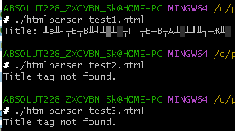

# Лабораторная работа №5: Работа с файлами и структурами данных в C

## Тема
Реализация программы для обработки данных студентов: чтение из файла, сортировка, сохранение результатов.

## 1. Постановка задачи
Разработать программу на C, которая:
1. Читает данные из текстового файла (формат: `Имя,оценка1,оценка2,оценка3,оценка4,оценка5`)
2. Сохраняет данные в массив структур `Student`
3. Сортирует студентов по среднему баллу
4. Записывает результаты в новый файл
5. Поддерживает сборку через Make, Meson и CMake

## Математическая модель
___
### Код программы:

data.h
```C
#ifndef DATA_H
#define DATA_H

typedef struct {
  char name[50];
  int scores[5];
  double average;
} Student;

int loadStudents(const char *filename, Student *arr, size_t max);
void sortByAverage(Student *arr, size_t count);
void saveReport(const char *filename, Student *arr, size_t count);

#endif
```

main.c

```C
#include "data.h"
#define MAX_STUDENTS 100

int main(int argc, char *argv[]) {
  if (argc < 3) {
    printf("Usage: %s input.txt output.txt\n", argv[0]);
    return 1;
  }
  
  Student students[MAX_STUDENTS];
  int count = loadStudents(argv[1], students, MAX_STUDENTS);
  sortByAverage(students, count);
  saveReport(argv[2], students, count);
  
  printf("Processed %d students. Results saved to %s\n", count, argv[2]);
  return 0;
}
```

data.c

```C
#include "data.h"
#include <stdio.h>

int loadStudents(const char *filename, Student *arr, size_t max) {
  FILE *f = fopen(filename, "r");
  if (!f) return -1;

  size_t count = 0;
  while (count < max && fscanf(f, "%49[^,],%d,%d,%d,%d,%d\n", 
         arr[count].name, &arr[count].scores[0], /*...*/) == 6) {
    int sum = 0;
    for (int i = 0; i < 5; i++) sum += arr[count].scores[i];
    arr[count].average = sum / 5.0;
    count++;
  }
  fclose(f);
  return count;
}

void sortByAverage(Student *arr, size_t count) {
  for (size_t i = 0; i < count-1; i++)
    for (size_t j = 0; j < count-i-1; j++)
      if (arr[j].average < arr[j+1].average) {
        Student tmp = arr[j];
        arr[j] = arr[j+1];
        arr[j+1] = tmp;
      }
}
```


```Make
C := gcc

CFLAGS := -Wall -Wextra -std=c11 -O2 # флаги компиляции

LDFLAGS :=

LDLIBS := -lm # связываем с math lib, если нужны математические функции

# Список исходников и целевой исполняемый файл

SRC := main.c data.c

OBJ := $(SRC:.c=.o)

TARGET := proj1

all: $(TARGET)

$(TARGET): $(OBJ)

    $(CC) $(LDFLAGS) $(OBJ) -o $@ $(LDLIBS)

# Правило для создания .o из .c (можно опустить, GNU Make имеет неявное правило)

%.o: %.c

    $(CC) $(CFLAGS) -c $< -o $@

clean:

    $(RM) $(OBJ) $(TARGET)
```

### Результаты работы программы:
 Make
 


Meson


CMake


Примечание:
(1)data.c - файл реализации функций
(2)data.h - описание этих функций
(3)main.c - основная часть, которая и описывает как реализуются функции.

чтобы добавить новый функционал, мы можем реализовать новые функции в (1), описать их в (2), и использовать в (3) как нам угодно.

## 2. Постановка задачи
Реализовать простенький эхосервер.


## Математическая модель
___
### Код программы:

data.h
```C

```

main.c

```C

```

data.c

```C

```


### Результаты работы программы:
 Make
 


Meson


CMake


Примечание: Не вышло корректно написать код под виндовс, особенно учиывая то, что я себе оставил слишком мало времени. да и сложность как то слишком резко скокнула, от 2+2 до чего то, что понять тяжело. может даже наверное не сложность каких товещей конкретных, а понимание. почему какието инклуды подсвечивает как ошибку. если бы дали просто задание реализовать какие то функции самим с использованием мейк, я бы понял. однако это какая то ерунда. как мне вникнуть в логику программы. первая еще ладно. но это... доступ в какой то сервер. если бы я хотя бы понимал как сети работают, этого же необъясняется. я стараюсь понимать, но не понимаю. извините. компиляции всегда выдавало ошибки. на мейк. другие даже не пробовал. 

скопировал код, пробовал переписывать, вникать

## 3. Постановка задачи

Считывание ссылок в HTML файле

### Математическая модель
___
### Код программы:

htmlutils.c
```C
#include "htmlutils.h"

#include <string.h>

int extract_title(const char *html, char *out, size_t out_size) {

    const char *tag_start = "<title>";

    const char *tag_end = "</title>";

    char *pos1 = strstr(html, tag_start);

    if (!pos1) return -1;

    pos1 += strlen(tag_start);

    char *pos2 = strstr(pos1, tag_end);

    if (!pos2) return -1;

    size_t title_len = pos2 - pos1;

    if (title_len >= out_size) title_len = out_size - 1;

    memcpy(out, pos1, title_len);

    out[title_len] = '\0';

    return 0;

}
```

main.c

```C
#include "htmlutils.h"

#include <stdio.h>

#include <string.h>

#include <stdlib.h>

// Если определено USE_CURL, будем использовать libcurl для скачивания

#ifdef USE_CURL

#include <curl/curl.h>

  

struct Buffer { char *data; size_t size; };

size_t write_cb(void *contents, size_t size, size_t nmemb, void *userp) {

    size_t total = size * nmemb;

    struct Buffer *buf = (struct Buffer*) userp;

    char *ptr = realloc(buf->data, buf->size + total + 1);

    if(!ptr) return 0;

    buf->data = ptr;

    memcpy(&(buf->data[buf->size]), contents, total);

    buf->size += total;

    buf->data[buf->size] = '\0';

    return total;

}

char *download_page(const char *url) {

    CURL *curl = curl_easy_init();

    if(!curl) return NULL;

    struct Buffer buf = { .data = malloc(1), .size = 0 };

    curl_easy_setopt(curl, CURLOPT_URL, url);

    curl_easy_setopt(curl, CURLOPT_WRITEFUNCTION, write_cb);

    curl_easy_setopt(curl, CURLOPT_WRITEDATA, &buf);

    CURLcode res = curl_easy_perform(curl);

    curl_easy_cleanup(curl);

    if(res != CURLE_OK) {

        free(buf.data);

        return NULL;

    }

    return buf.data;

}

#endif

int main(int argc, char *argv[]) {

    if(argc < 2) {

        fprintf(stderr, "Usage: %s <file_or_url>\n", argv[0]);

        return 1;

    }

    char *html_content = NULL;

    // Проверим, начинается ли аргумент с "http://"

    if(strncmp(argv[1], "http://", 7) == 0 || strncmp(argv[1], "https://", 8) == 0) {

        #ifdef USE_CURL

        html_content = download_page(argv[1]);

        if(!html_content) {

            fprintf(stderr, "Failed to download %s\n", argv[1]);

            return 1;

        }

        #else

        fprintf(stderr, "This program was built without libcurl support.\n");

        return 1;

        #endif

    }

    else {

        // читаем локальный файл

        FILE *f = fopen(argv[1], "r");

        if(!f) { perror("fopen"); return 1; }

        fseek(f, 0, SEEK_END);

        long size = ftell(f);

        fseek(f, 0, SEEK_SET);

        html_content = malloc(size + 1);

        if(html_content) {

            fread(html_content, 1, size, f);

            html_content[size] = '\0';

        }

        fclose(f);

    }

    if(!html_content) {

        fprintf(stderr, "Could not load content.\n");

        return 1;

    }

    char title[256];

    if(extract_title(html_content, title, sizeof(title)) == 0) {

        printf("Title: %s\n", title);

    } else {

        printf("Title tag not found.\n");

    }

    free(html_content);

    return 0;

}
```

htmlutils.h

```C
#ifndef HTMLUTILS_H

#define HTMLUTILS_H

#include <stddef.h>

int extract_title(const char *html, char *out, size_t out_size);

// возможно, другие функции: extract_links, и т.д.

#endif
```


### Результаты работы программы:
 Make
 


Meson



CMake


Примечание:
## 4. Постановка задачи

Основные вычисления линейной алгебры: операции над векторами и матрицами

## Математическая модель
___
### Код программы:

linalg.h
```C
#ifndef LINALG_H

#define LINALG_H

// Функция для умножения матриц.

// A размером r1 x c1, B размером c1 x c2; результат C размером r1 x c2 (должен быть выделен

void mat_multiply(double **A, double **B, double **C, int r1, int c1, int c2);

// Функция для выделения памяти под матрицу r x c

double **alloc_matrix(int r, int c);

// Освобождение памяти матрицы

void free_matrix(double **M, int r);

#endif
```

main.c

```C
#include "linalg.h"

#include <stdio.h>

#include <stdlib.h>

int main(int argc, char *argv[]) {

    if(argc < 2) {

        fprintf(stderr, "Usage: %s <matrix_file>\n", argv[0]);

        return 1;

    }

    FILE *f = fopen(argv[1], "r");

    if(!f) { perror("fopen"); return 1; }

    int r1, c1, r2, c2;

    // ожидаем в файле: размеры первой матрицы, потом сами элементы, затем размеры второй и

    if(fscanf(f, "%d %d", &r1, &c1) != 2) { fprintf(stderr, "Invalid format\n"); return 1; }

    double **A = alloc_matrix(r1, c1);

  

    for(int i=0; i<r1; ++i) {

        for(int j=0; j<c1; ++j) {

            fscanf(f, "%lf", &A[i][j]);

        }

    }

    if(fscanf(f, "%d %d", &r2, &c2) != 2) { fprintf(stderr, "Invalid format\n"); return 1; }

    double **B = alloc_matrix(r2, c2);

    for(int i=0; i<r2; ++i) {

        for(int j=0; j<c2; ++j) {

            fscanf(f, "%lf", &B[i][j]);

        }

    }

    fclose(f);

    if(c1 != r2) {

        fprintf(stderr, "Matrix dimensions incompatible for multiplication\n");

        return 1;

    }

    double **C = alloc_matrix(r1, c2);

    mat_multiply(A, B, C, r1, c1, c2);

    // Вывод результата

    printf("Result matrix (%dx%d):\n", r1, c2);

    for(int i=0; i<r1; ++i) {

        for(int j=0; j<c2; ++j) {

            printf("%8.2f ", C[i][j]);

        }

        printf("\n");

    }

    // освобождаем память

    free_matrix(A, r1);

    free_matrix(B, r2);

    free_matrix(C, r1);

    return 0;

}
```

linalg.c

```C
#include "linalg.h"

#include <stdlib.h>

void mat_multiply(double **A, double **B, double **C, int r1, int c1, int c2) {

    for(int i=0; i<r1; ++i) {

        for(int j=0; j<c2; ++j) {

            C[i][j] = 0.0;

            for(int k=0; k<c1; ++k) {

                C[i][j] += A[i][k] * B[k][j];

            }

        }

    }

}

double **alloc_matrix(int r, int c) {

    double **M = malloc(r * sizeof(double*));

    if (!M) return NULL;

    for(int i=0; i<r; ++i) {

        M[i] = malloc(c * sizeof(double));

        if(!M[i]) { /* handle allocation error, not shown for brevity */ }

    }

    return M;

}

void free_matrix(double **M, int r) {

    if (!M) return;

    for(int i=0; i<r; ++i) {

        free(M[i]);

    }

    free(M);

}
```


### Результаты работы программы:
 Make
 


Meson


CMake


Примечание:

## 5. Постановка задачи


## Математическая модель
___
### Код программы:

data.h
```C

```

main.c

```C

```

data.c

```C

```


### Результаты работы программы:
 Make
 


Meson


CMake


Примечание:

## 6. Постановка задачи


## Математическая модель
___
### Код программы:

data.h
```C

```

main.c

```C

```

data.c

```C

```


### Результаты работы программы:
 Make
 


Meson


CMake


Примечание:

## 7. Постановка задачи


## Математическая модель
___
### Код программы:

data.h
```C

```

main.c

```C

```

data.c

```C

```


### Результаты работы программы:
 Make
 


Meson


CMake


Примечание:

## 8. Постановка задачи


## Математическая модель
___
### Код программы:

data.h
```C

```

main.c

```C

```

data.c

```C

```


### Результаты работы программы:
 Make
 


Meson


CMake


Примечание:
