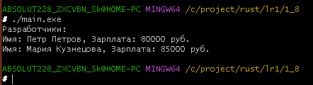

# Rust ­ Лабораторная работа #1
### 1.1 Постановка задачи:
Напишите программу, которая запрашивает у пользователя имя и выводит на экран приветственное сообщение с использованием этого имени.
### Математическая модель:
___
### Список идентификаторов:
<table>
  <tr>
    <th>имя</th>
    <th>тип</th>
	<th>смысл</th>
  </tr>
  <tr>
    <td>name</td>
    <td>mut, str</td>
    <td>Ввод имени</td>
  </tr>
</table>

### Код программы:


```Rust
use std::io;

  

fn main() {

    println!("Введите имя:");

    let mut name = String::new();

    io::stdin().read_line(&mut name).unwrap();

    println!("Привет, {}!", name.trim());

}
```

### Результаты работы программы:


### 1.2 Постановка задачи:
Создайте переменную типа целое беззнаковое число и выведите ее значение на экран. Явно укажите тип переменной. Затем измените значение переменной и снова выведите его.
### Математическая модель:
___
### Список идентификаторов:
<table>
  <tr>
    <th>имя</th>
    <th>тип</th>
	<th>смысл</th>
  </tr>
  <tr>
    <td>a</td>
    <td>i16</td>
    <td>хранить число 16 бит)</td>
  </tr>
</table>

### Код программы:


```Rust
fn main()

{

    let mut a: i16;

    a = 128;

    println!("your number is {}", a);

    a = 322;

    println!("your number is {}", a);

}
```

### Результаты работы программы:


### 1.3 Постановка задачи:
Напишите функцию, которая принимает строку и возвращает ее длину (количество символов). Затем вызовите эту функцию с различными строками.
### Математическая модель:
___
### Список идентификаторов:
<table>
  <tr>
    <th>имя</th>
    <th>тип</th>
	<th>смысл</th>
  </tr>
  <tr>
    <td>abobus</td>
    <td>str</td>
    <td>хранение строки</td>
  </tr>
</table>

### Код программы:


```Rust
fn main()

{

    let abobus = "привет, читатель";

    len_str(abobus);

}

fn len_str(a: &str)

{

    let l = a.chars().count();

    println!("строчка '{}' имеет {} символов", a, l);

}
```

### Результаты работы программы:


### 1.4 Постановка задачи:
Задайте структуру Car с полями brand, model и year, и создайте несколько экземпляров этой структуры. Выведите информацию о каждой машине на экран.
### Математическая модель:
___
### Список идентификаторов:
<table>
  <tr>
    <th>имя</th>
    <th>тип</th>
	<th>смысл</th>
  </tr>
  <tr>
    <td>car1, car2, car3</td>
    <td>Car</td>
    <td>присваиваются характеристики машин для вывода</td>
  </tr>
</table>

### Код программы:


```Rust
struct Car {

    brand: String,

    model: String,

    year: u32,

}

  

impl Car {

    fn new(brand: &str, model: &str, year: u32) -> Car {

        Car {

            brand: brand.to_string(),

            model: model.to_string(),

            year,

        }

    }

  

    fn display_info(&self) {

        println!("Марка: {}, Модель: {}, Год: {}", self.brand, self.model, self.year);

    }

}

  

fn main() {

    let car1 = Car::new("Toyota", "Camry", 2020);

    let car2 = Car::new("Honda", "Civic", 2018);

    let car3 = Car {

        brand: String::from("Ford"),

        model: String::from("Mustang"),

        year: 2022,

    };

  

    car1.display_info();

    car2.display_info();

    car3.display_info();

}
```

### Результаты работы программы:


### 1.5 Постановка задачи:
Напишите программу, которая запрашивает у пользователя число 𝑁 и выводит на экран 𝑁­ное число Фибоначчи. Используйте рекурсию для решения этой задач
### Математическая модель:
___
### Список идентификаторов:
<table>
  <tr>
    <th>имя</th>
    <th>тип</th>
	<th>смысл</th>
  </tr>
  <tr>
    <td>input</td>
    <td>string</td>
    <td>ввод и хранение данных с клавиатуры</td>
  </tr>
  <tr>
    <td>n</td>
    <td>u32</td>
    <td>опрелеляет номер вызываемого числа фибаначи</td>
  </tr>
  <tr>
    <td>result</td>
    <td>u32</td>
    <td>результат</td>
  </tr>
</table>

### Код программы:


```Rust
use std::io;

  

fn fibonacci(n: u32) -> u32 {

    match n {

        0 => 0,

        1 => 1,

        _ => fibonacci(n - 1) + fibonacci(n - 2),

    }

}

  

fn main() {

    println!("Введите число N для вычисления N-ного числа Фибоначчи:");

    let mut input = String::new();

    io::stdin()

        .read_line(&mut input)

        .expect("Не удалось прочитать строку");

    let n: u32 = input.trim().parse().expect("Пожалуйста, введите целое число!");

    if n > 40 {

        println!("Внимание: рекурсивный метод будет работать медленно для n > 40");

    }

    let result = fibonacci(n);

    println!("{}-ное число Фибоначчи: {}", n, result);

}
```

### Результаты работы программы:


### 1.6 Постановка задачи:
Реализуйте перечисление DayOfWeek для дней недели. Напишите функцию, которая принимает день недели и возвращает следующий день. Обработайте случаи перехода на следующий день недели, если текущий день – воскресенье.
### Математическая модель:
___
### Список идентификаторов:
<table>
  <tr>
    <th>имя</th>
    <th>тип</th>
	<th>смысл</th>
  </tr>
  <tr>
    <td>today</td>
    <td>DayOfWeek</td>
    <td>Результат</td>
  </tr>
  <tr>
    <td>tomorrow</td>
    <td>DayOfWeek</td>
    <td>Результат</td>
  </tr>
  <tr>
    <td>sunday</td>
    <td>DayOfWeek</td>
    <td>Результат</td>
  </tr>
  <tr>
    <td>next</td>
    <td>DayOfWeek</td>
    <td>Результат</td>
  </tr>
</table>

### Код программы:


```Rust


enum DayOfWeek {

    Monday,

    Tuesday,

    Wednesday,

    Thursday,

    Friday,

    Saturday,

    Sunday,

}

  


fn next_day(day: DayOfWeek) -> DayOfWeek {

    match day {

        DayOfWeek::Monday => DayOfWeek::Tuesday,

        DayOfWeek::Tuesday => DayOfWeek::Wednesday,

        DayOfWeek::Wednesday => DayOfWeek::Thursday,

        DayOfWeek::Thursday => DayOfWeek::Friday,

        DayOfWeek::Friday => DayOfWeek::Saturday,

        DayOfWeek::Saturday => DayOfWeek::Sunday,

        DayOfWeek::Sunday => DayOfWeek::Monday, 

    }

}

  

fn main() {


    let today = DayOfWeek::Wednesday;

    let tomorrow = next_day(today);

    println!("today will be {:?}", tomorrow);

  


    let sunday = DayOfWeek::Sunday;

    let next = next_day(sunday);

    println!("after sundey be {:?}", next);

}
```

### Результаты работы программы:


### 1.7 Постановка задачи:
Создайте структуру Product с полями name, price и category, а также перечисление (enum) Category для категорий товаров. Напишите метод для вывода информации о продукте и ассоциированную функцию для подсчета общей суммы товаров в заданной категории из массива продуктов.
### Математическая модель:
___
### Список идентификаторов:
<table>
  <tr>
    <th>имя</th>
    <th>тип</th>
	<th>смысл</th>
  </tr>
  <tr>
    <td>products</td>
    <td>Product</td>
	    <td>хранит товары</td>
  </tr>
  <tr>
    <td>electronics_total</td>
    <td>f64</td>
    <td>сумма цен электроники</td>
  </tr>
  <tr>
    <td>clothing_total</td>
    <td>f64</td>
    <td>сумма цен одежды</td>
  </tr>
  </table>

### Код программы:


```Rust


enum Category {

    Electronics,

    Clothing,

    Food,

  

}

  


struct Product {

    name: String,

    price: f64,

    category: Category,

}

  

impl Product {

   

    fn display_info(&self) {

        println!(

            "Продукт: {}, Цена: {:.2} руб., Категория: {:?}",

            self.name, self.price, self.category

        );

    }

  

    fn total_price_in_category(products: &[Product], category: Category) -> f64 {

        products

            .iter()

            .filter(|p| p.category == category)

            .map(|p| p.price)

            .sum()

    }

}

  

fn main() {


    let products = [

        Product {

            name: String::from("Ноутбук"),

            price: 89999.99,

            category: Category::Electronics,

        },

        Product {

            name: String::from("Футболка"),

            price: 1999.99,

            category: Category::Clothing,

        },

        Product {

            name: String::from("Хлеб"),

            price: 59.99,

            category: Category::Food,

        },

        Product {

            name: String::from("Наушники"),

            price: 5999.99,

            category: Category::Electronics,

        },

    ];

  


    for product in &products {

        product.display_info();

    }


    let electronics_total = Product::total_price_in_category(&products, Category::Electronics);

    println!("\nОбщая стоимость электроники: {:.2} руб.", electronics_total);


    let clothing_total = Product::total_price_in_category(&products, Category::Clothing);

    println!("Общая стоимость одежды: {:.2} руб.", clothing_total);

}
```

### Результаты работы программы:


### 1.8 Постановка задачи:
Создайте структуру Employee с полями name, position, salary, а также перечисление Position для должностей сотрудников. Напишите функцию, которая принимает вектор сотрудников и возвращает вектор сотрудников заданной должности.
### Математическая модель:
___
### Список идентификаторов:
<table>
  <tr>
    <th>имя</th>
    <th>тип</th>
	<th>смысл</th>
  </tr>
  <tr>
    <td>employees</td>
    <td>Vec(Employee)</td>
    <td>Список всех сотрудников</td>
  </tr>
  <tr>
    <td>developers</td>
    <td>Vec(Employee)</td>
    <td>Отфильтрованный список сотрудников с должностью</td>
  </tr>
  <tr>
    <td>dev</td>
    <td>Employee</td>
    <td>Текущий сотрудник при переборе вектора</td>
  </tr>
</table>

### Код программы:


```Rust
#[derive(Debug, PartialEq)]

enum Position {

    Manager,

    Developer,

    Designer

}

  
  

struct Employee {

    name: String,

    position: Position,

    salary: u32,

}

  

impl Employee {

    fn filter_by_position(employees: Vec<Employee>, position: Position) -> Vec<Employee> {

        employees

            .into_iter()

            .filter(|emp| emp.position == position)

            .collect()

    }

}

  

fn main() {

    let employees = vec![

        Employee {

            name: String::from("Иван Иванов"),

            position: Position::Manager,

            salary: 100000,

        },

        Employee {

            name: String::from("Петр Петров"),

            position: Position::Developer,

            salary: 80000,

        },

        Employee {

            name: String::from("Анна Сидорова"),

            position: Position::Designer,

            salary: 75000,

        },

        Employee {

            name: String::from("Мария Кузнецова"),

            position: Position::Developer,

            salary: 85000,

        },

    ];

  

    let developers = Employee::filter_by_position(employees, Position::Developer);

  

    println!("Разработчики:");

    for dev in developers {

        println!(

            "Имя: {}, Зарплата: {} руб.",

            dev.name, dev.salary

        );

    }

}
```

### Результаты работы программы:



### Информация о студенте:

Лузан Богдан, 1 курс, группа ИВТ 2.1